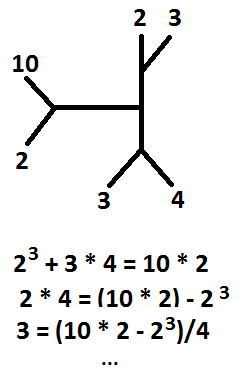

A new math notation
===================
This repository contains the description of a new
math notation based on simple 2D diagrams.

These diagrams simplify the way we write numbers,
and their relations with each other, using a non-linear
graphic notation.

This notation is new, so I know it is not complete.
I welcome  you to fork and extend it!

An example
----------
This example uses the main three operators to represent
all the math expressions shown at bottom of image:

Adventages
----------
This notation has many adventages over orthodox
arithmetic notation:
* Operator's precedence doesn't exist.
* Order of operations is explicit (since it's
  a non linear notation).
* Variable isolation is non existent.
* Many orthodox equations can be represented using just a
  simple expression in this new notation.
* This new notation has less operators.

See more
--------
* [More examples](EXAMPLES.md)
* [Specifications](SPECIFICATION.md)

A personal note
---------------
I don't know if this idea is new or already exists in any
other way, but I believe it can be useful to remember your
kinetic equations.