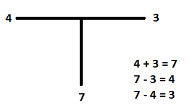
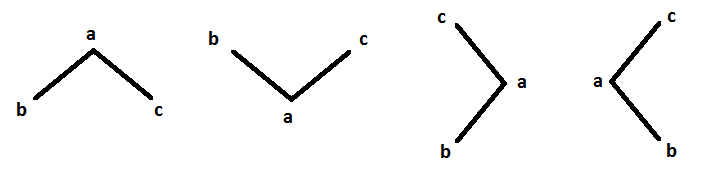
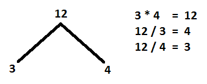
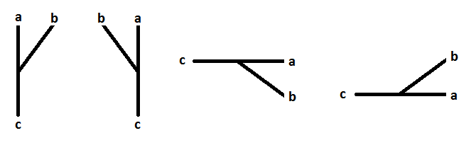

This text contains the specification for
my new math notation.

## General rules
* All operands are integers or variables. No decimals or
  negative numbers are allowed, since there are different
  ways to represent them using the operators.
* All operators are simple open figures. They can have
  symmetric branches, and all symmetric branches are
  commutative.

##The T operator

This operator generalizes two conventional operations:
* Addition
* Subtraction

The T operator can be written in four different ways:

Any of the four previous T figures represent, at the same time,
any of these expressions:
* a = b + c
* a - b = c
* a - c = b

The symmetric branches of the T operator are always commutative.
In the previous figures, `b` and `c` are commutative.

#### An example

The next example shows how to represent an arithmetic expressions
using the T operator.

## The V operator

This operator generalizes two conventional operations:
* Multiplication
* Division

Any of the four previous V figures represent, at the same time,
any of these expressions:
* a = b * c
* a / b = c
* a / c = b

As in the T operator, the V operator has two symmetric branches,
so `b` and `c` are commutative operands.

#### An example
The next example shows how to represent an arithmetic expressions
using the V operator.

## The Y operator
This operator generalizes three conventional operations:
* Logarithms
* Exponentiation
* nth root
* Logarithm

* a ^ b = c
* b-root of c = a
* logarithm base-a of c = b

There are no commutative operands in the Y operator.