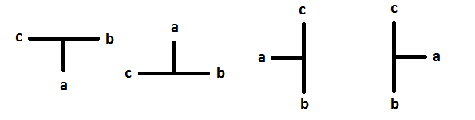

This text contains the specification for
my new math notation.

The T operator
==============
This operator generalizes two conventional operations:
* Addition
* Subtraction

The T operator can be written in four different ways:

Any of the four previous figures represent, at the same time,
any of these expressions:
* a = b + c
* a - b = c
* a - c = b

The symmetric branches of the T operator are always commutative.
In the previous figures, `b` and `c` are commutative.

An example
----------
The next example shows how to represent an arithmetic expressions
using the T operator.

